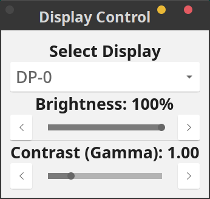

# Display Control

A simple GTK application for controlling screen brightness and gamma on the GhostBSD or FreeBSD desktop.

## Features

- Adjust screen brightness.
- Adjust screen contrast (gamma).
- Select from multiple connected displays.
- A clean, simple, and lightweight interface.

## Requirements

This application is designed for GhostBSD running the **X Window System (X11)**, which is the default for desktops like MATE and XFCE.

It has two main dependencies that must be installed on your system for the binary to run:

1.  **`xrandr`**: A command-line tool that the application uses to interface with the display server to change screen settings.
2.  **GTK4 Libraries**: The graphical interface is built with GTK4, and its runtime libraries must be available on your system.

## Installation

To install and run the `display-control` binary on GhostBSD, follow these steps.

### 1. Install Dependencies

First, open a terminal and install the required `xrandr` tool and GTK4 runtime libraries using the `pkg` package manager.

```
sudo pkg install xrandr gtk4
```

Of course. Here is the content for the README.md file, formatted in GitHub Flavored Markdown. You can copy and paste the text below directly into a README.md file in your repository.
Markdown

## Display Control for GhostBSD and FreeBSD

A simple GTK application for controlling screen brightness and gamma on the GhostBSD desktop.




## Features

- Adjust screen brightness.
- Adjust screen contrast (gamma).
- Select from multiple connected displays.
- A clean, simple, and lightweight interface.

## Requirements

This application is designed for GhostBSD running the **X Window System (X11)**, which is the default for desktops like MATE and XFCE.

It has two main dependencies that must be installed on your system for the binary to run:

1.  **`xrandr`**: A command-line tool that the application uses to interface with the display server to change screen settings.
2.  **GTK4 Libraries**: The graphical interface is built with GTK4, and its runtime libraries must be available on your system.

## Installation

To install and run the `display-control` binary on GhostBSD, follow these steps.

### 1. Install Dependencies

First, open a terminal and install the required `xrandr` tool and GTK4 runtime libraries using the `pkg` package manager.

```
sudo pkg install xrandr gtk4
```

### 2. Download the Binary

Download the display-control binary file from the Releases page of this repository.

(Note: Remember to update the link to your repository's releases page.)

### 3. Make the Binary Executable

Navigate to your Downloads directory (or wherever you saved the file) and make the binary executable.

```
chmod +x display-control
```

### 4. Move to Your PATH (Recommended)

To make the application available system-wide from any terminal, move it to /usr/local/bin.
```
sudo mv display-control /usr/local/bin/
```

## Usage

Once installed, you can launch the application by opening a terminal and typing its name:

```
display-control
```

To launch it without tying up your terminal, run it in the background:
```
display-control
```

## License

This project is licensed under the MIT License.

